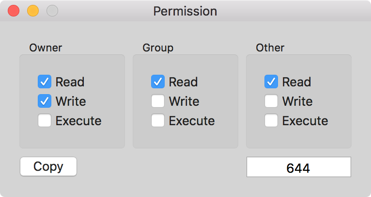

# Permission
An amazingly simple `chmod` calculator for file permissions. I used to be _so_ good at this back in college when I first learned Linux. Now, I *barely* get by ever since I started messing around with the _non-numerical_ permission changes (e.g. `chmod a+r ...`).

Enough excuses, here is the macOS native App I've always wanted to make and never really got around to! I liked how simple and clean [this site works](http://www.onlineconversion.com/html_chmod_calculator.htm) so I'm going to _steal_ some of its design.
